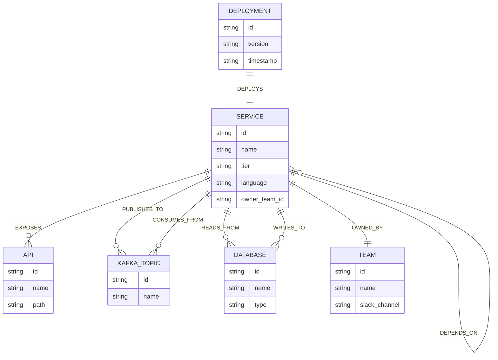

# ImpactGraph

Production change impact analyzer for release engineers. Before you deploy a
service, ImpactGraph answers: what breaks, who's affected, and how far the
blast radius reaches — by modeling your architecture as a graph and
traversing it instead of joining tables.

Backed by **CognoDB Cloud** (a managed graph database speaking openCypher
over Bolt 5.0–5.4, compatible with the official Neo4j drivers).

> **Status:** work in progress, built phase by phase. This README is filled
> in as each phase lands.

## Table of contents

- [Data model](#data-model)
- [Repo structure](#repo-structure)
- [Why a graph database?](#why-a-graph-database) _(Phase 5)_
- [Seed data](#seed-data) _(Phase 2)_
- [Queries](#queries) _(Phase 3)_
- [Setup & run](#setup--run) _(Phase 5)_
- [Screenshots](#screenshots) _(Phase 5)_
- [Deployment](#deployment) _(Phase 6)_

## Data model

ImpactGraph models a microservice architecture as a property graph: services,
the APIs they expose, the Kafka topics they publish/consume, the databases
they touch, the teams that own them, and the deployments that ship them.

**Nodes**

| Label | Properties |
| --- | --- |
| `Service` | `id`, `name`, `tier`, `language`, `owner_team_id` |
| `API` | `id`, `name`, `path` |
| `Database` | `id`, `name`, `type` (postgres / redis / s3 / …) |
| `KafkaTopic` | `id`, `name` |
| `Team` | `id`, `name`, `slack_channel` |
| `Deployment` | `id`, `version`, `timestamp` |

**Relationships**

| Relationship | Meaning |
| --- | --- |
| `(:Service)-[:DEPENDS_ON]->(:Service)` | Synchronous call dependency |
| `(:Service)-[:EXPOSES]->(:API)` | Service exposes an API |
| `(:Service)-[:PUBLISHES_TO]->(:KafkaTopic)` | Async producer edge |
| `(:Service)-[:CONSUMES_FROM]->(:KafkaTopic)` | Async consumer edge |
| `(:Service)-[:READS_FROM]->(:Database)` | Read dependency |
| `(:Service)-[:WRITES_TO]->(:Database)` | Write dependency |
| `(:Service)-[:OWNED_BY]->(:Team)` | Ownership |
| `(:Deployment)-[:DEPLOYS]->(:Service)` | Deployment history |



A `DEPENDS_ON` edge is directed from the caller to the callee, so a
variable-length traversal outward from a service (`(:Service)-[:DEPENDS_ON*1..4]->`)
naturally follows "who breaks if I go down" rather than "who I depend on."

## Repo structure

```
impact-graph/
├── backend/                 # Node.js + TypeScript + Express API
│   └── src/
│       ├── config/          # env loading / validation
│       ├── db/               # Neo4j driver connection layer
│       ├── routes/           # Express route definitions
│       ├── controllers/      # request handlers
│       ├── services/         # business logic orchestration
│       ├── queries/          # parameterized Cypher, one concern per file
│       ├── middleware/       # error handling, request logging, etc.
│       ├── types/            # shared TS types
│       ├── seed/             # dataset + loader script (Phase 2)
│       └── docs/             # OpenAPI/Swagger spec
└── frontend/                 # Next.js 15 + React 19 + TypeScript
    └── src/
        ├── app/               # App Router pages
        ├── components/        # UI components (shadcn/ui primitives + custom)
        ├── hooks/             # React hooks (data fetching, graph state)
        ├── lib/               # utilities, API client
        └── types/             # shared TS types
```

**Backend stack:** Express, TypeScript, official `neo4j-driver`, Zod
(request validation), dotenv, CORS, Helmet, Morgan, Swagger/OpenAPI, tsx,
ESLint, Prettier.

**Frontend stack:** Next.js 15, React 19, TypeScript, Tailwind CSS,
shadcn/ui, TanStack Query, Cytoscape.js (via `react-cytoscapejs`) for the
force-directed blast-radius graph, React Hook Form + Zod, Lucide icons,
Sonner (toasts), Framer Motion, next-themes.

## Why a graph database?

_Coming in Phase 5 — will contrast the blast-radius and single-point-of-failure
queries against what they'd require in a relational schema._

## Seed data

_Coming in Phase 2._

## Queries

_Coming in Phase 3._

## Setup & run

_Coming in Phase 5._

## Screenshots

_Coming in Phase 5._

## Deployment

_Coming in Phase 6._
