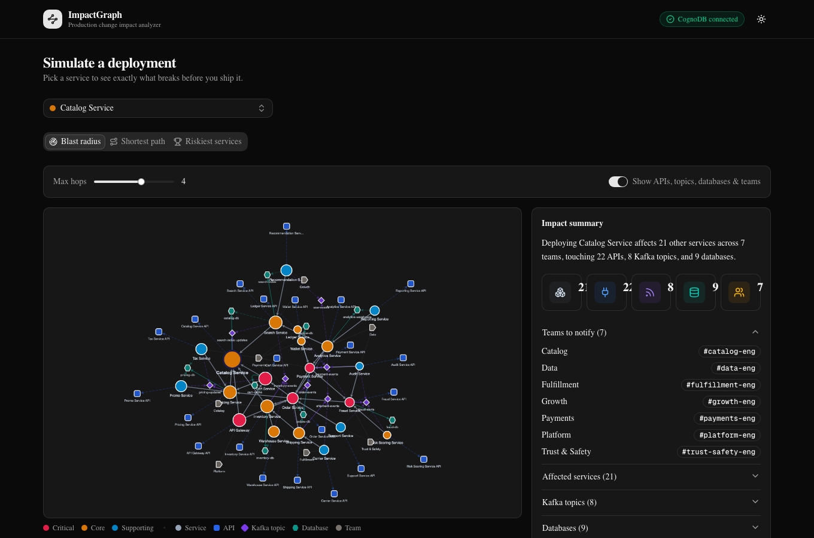
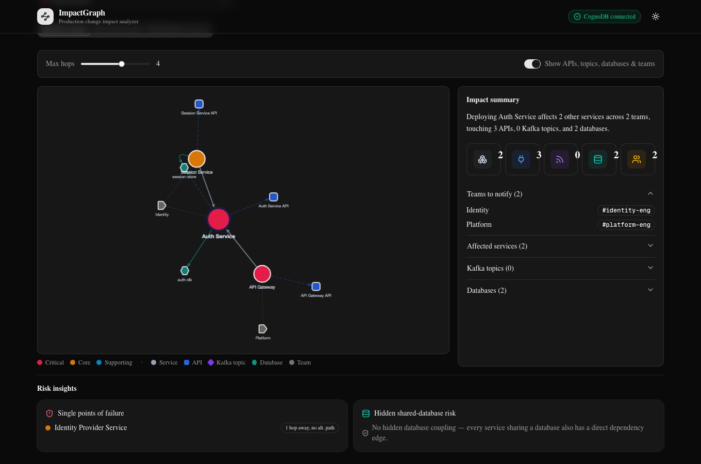
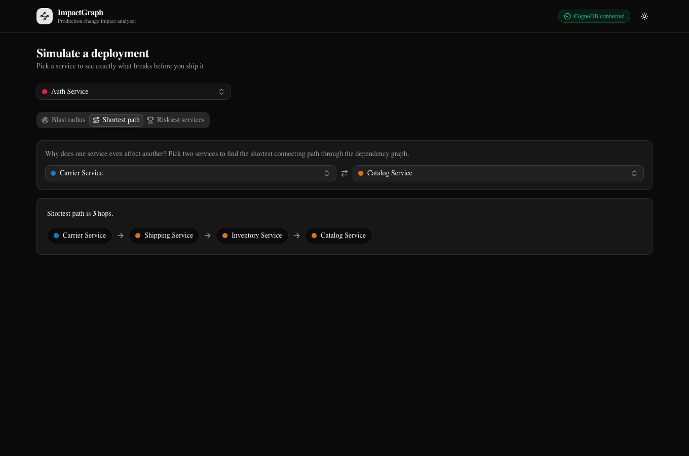
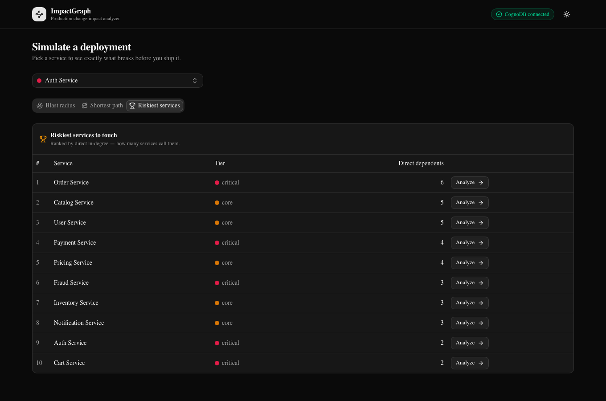
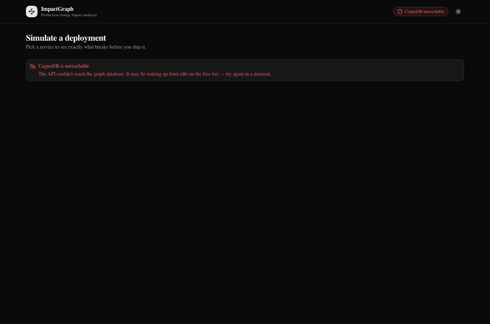
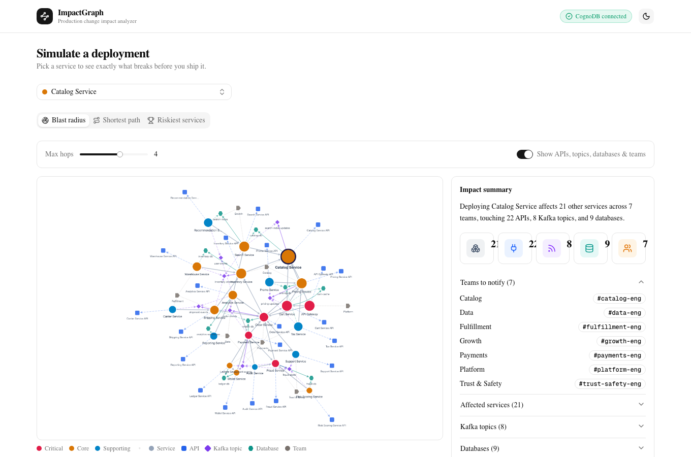

# ImpactGraph

Production change impact analyzer for release engineers. Before you deploy a
service, ImpactGraph answers: what breaks, who's affected, and how far the
blast radius reaches, by modeling your architecture as a graph and
traversing it instead of joining tables.

Backed by **CognoDB Cloud** (a managed graph database speaking openCypher
over Bolt 5.0–5.4, compatible with the official Neo4j drivers).

## Table of contents

- [Data model](#data-model)
- [Repo structure](#repo-structure)
- [Why a graph database?](#why-a-graph-database)
- [Seed data](#seed-data)
- [Queries](#queries)
- [Setup & run](#setup--run)
- [Screenshots](#screenshots)
- [Deployment](#deployment)

## Data model

ImpactGraph models a microservice architecture as a property graph: services,
the APIs they expose, the Kafka topics they publish/consume, the databases
they touch, the teams that own them, and the deployments that ship them.

**Nodes**

| Label | Properties |
| --- | --- |
| `Service` | `id`, `name`, `tier`, `language`, `owner_team_id` |
| `API` | `id`, `name`, `path` |
| `Database` | `id`, `name`, `type` (postgres / redis / s3 / …) |
| `KafkaTopic` | `id`, `name` |
| `Team` | `id`, `name`, `slack_channel` |
| `Deployment` | `id`, `version`, `timestamp` |

**Relationships**

| Relationship | Meaning |
| --- | --- |
| `(:Service)-[:DEPENDS_ON]->(:Service)` | Synchronous call dependency |
| `(:Service)-[:EXPOSES]->(:API)` | Service exposes an API |
| `(:Service)-[:PUBLISHES_TO]->(:KafkaTopic)` | Async producer edge |
| `(:Service)-[:CONSUMES_FROM]->(:KafkaTopic)` | Async consumer edge |
| `(:Service)-[:READS_FROM]->(:Database)` | Read dependency |
| `(:Service)-[:WRITES_TO]->(:Database)` | Write dependency |
| `(:Service)-[:OWNED_BY]->(:Team)` | Ownership |
| `(:Deployment)-[:DEPLOYS]->(:Service)` | Deployment history |

## Repo structure

```
impact-graph/
├── backend/                 # Node.js + TypeScript + Express API
│   └── src/
│       ├── config/          # env loading / validation
│       ├── db/               # Neo4j driver connection layer
│       ├── routes/           # Express route definitions
│       ├── controllers/      # request handlers
│       ├── services/         # business logic orchestration
│       ├── queries/          # parameterized Cypher, one concern per file
│       ├── middleware/       # error handling, request logging, etc.
│       ├── types/            # shared TS types
│       ├── seed/             # dataset + loader script
│       └── docs/             # OpenAPI/Swagger spec
└── frontend/                 # Next.js 15 + React 19 + TypeScript
    └── src/
        ├── app/               # App Router pages
        ├── components/        # UI components (shadcn/ui primitives + custom)
        ├── hooks/             # React hooks (data fetching, graph state)
        ├── lib/               # utilities, API client
        └── types/             # shared TS types
```

**Backend stack:** Express, TypeScript, official `neo4j-driver`, Zod
(request validation), dotenv, CORS, Helmet, Morgan, Swagger/OpenAPI, tsx,
ESLint, Prettier.

**Frontend stack:** Next.js 15, React 19, TypeScript, Tailwind CSS,
shadcn/ui, TanStack Query, Cytoscape.js (via `react-cytoscapejs`) for the
force-directed blast-radius graph, React Hook Form + Zod, Lucide icons,
Sonner (toasts), Framer Motion, next-themes.

## Why a graph database?

The underlying data, services, APIs, topics, databases, teams, and seven
kinds of relationship between them, could absolutely be stored in Postgres.
The reason it isn't is the two queries that matter most here:

**Blast radius is an unbounded-depth traversal across a heterogeneous
relationship set.** "What breaks if I deploy this" isn't a join, it's
"follow `DEPENDS_ON` backwards as far as it goes, then for everyone you find,
also follow `EXPOSES`, `PUBLISHES_TO`, `CONSUMES_FROM`, `READS_FROM`,
`WRITES_TO`, and `OWNED_BY`." In Cypher that's query 1 below:
`(start)<-[:DEPENDS_ON*1..4]-(dependent)`, one line, cost proportional to the
subgraph actually touched. In Postgres, "however many hops it takes" forces a
choice between a fixed number of stacked self-joins (wrong the moment your
architecture grows past that hop count, ours has a genuine 4-hop chain) or a
recursive CTE, and either way you're still hand-joining six more tables per
row to pull in APIs/topics/databases/teams. The graph doesn't have a "how
many joins" question at all, depth is a traversal parameter, not a schema
decision.

**Single point of failure is a path-existence problem, and relational
engines have no primitive for that.** Query 3 below asks: for something this
service depends on, does *any other service in the
entire graph* have a route to it that doesn't pass through this one? That's
"enumerate every path to Y, then check whether X appears on all of them",
in SQL, a recursive CTE to materialize every path as a row, followed by a
`GROUP BY` / `HAVING count(*) FILTER (...) = 0` anti-join to find the paths
that avoid X. It's expressible, but nobody reaches for it, and it re-scans
the same subgraph for every candidate. In Cypher it's `OPTIONAL MATCH` plus
a `CASE`-driven count, see the query for the exact shape, and the sidebar
underneath it for the CognoDB-specific implementation detail that made the
"obvious" version of this query wrong.

Two smaller things reinforce the same point without being the headline:
shared-database risk (query 5 below) is a straightforward join-and-anti-join
and would honestly be *fine* in
Postgres, it's here because it's the kind of finding a graph view surfaces
naturally alongside the traversal queries, not because relational makes it
awkward. And the schema itself: adding a ninth relationship type here means
one more `MERGE` in the seed script, not a migration, a new foreign key, and
a new join added to five existing queries.

## Seed data

`backend/src/seed/` contains a fictional but realistic mid-sized microservice
architecture and the loader that writes it into CognoDB. It's runnable
independently of the API server:

```bash
cd backend
npm install
cp .env.example .env   # fill in COGNODB_URI / COGNODB_USER / COGNODB_PASSWORD
npm run seed
```

The dataset:

- **32 services** across 8 domains (payments, identity, catalog, growth,
  trust & safety, fulfillment, platform, data), each exposing one API and
  owned by one of **8 teams**.
- **45 `DEPENDS_ON` edges** forming a layered call graph up to 4 hops deep,
  e.g. `api-gateway → order-service → cart-service → pricing-service →
  catalog-service`. Deploying `catalog-service` alone reaches 21 of the 32
  services within 4 hops.
- **13 databases** (postgres / redis / s3 / elasticsearch), two of them
  deliberately shared writers (`order-service` + `payment-service` both write
  `orders-db`; `ledger-service` + `wallet-service` both write `ledger-db`) to
  exercise the shared-database-risk query.
- **9 Kafka topics** with realistic fan-out (`order-events` alone is consumed
  by 4 downstream services).
- `identity-provider-service` is reachable only through `auth-service`, a
  clean single-point-of-failure example.
- **20 deployment records** for release history.

All node/relationship writes are parameterized (`UNWIND $rows AS row MERGE
...`) and keyed on a stable `id`, so re-running `npm run seed` is idempotent
rather than duplicating data.

## Queries

All queries live in `backend/src/queries/`, one file per concern, run through
the official `neo4j-driver` with every value passed as a bound parameter
(`session.run(query, { serviceId, ... })`), never string-concatenated into
the Cypher. The one narrow exception is documented below.

### 1. Blast radius, `GET /api/services/:id/blast-radius?maxHops=`

The centerpiece. `DEPENDS_ON` is directed caller → callee, so "what breaks if
I deploy this service" is the *reverse* traversal, every service reachable
by walking `DEPENDS_ON` backwards from the target:

```cypher
MATCH (start:Service {id: $serviceId})
OPTIONAL MATCH path = (start)<-[:DEPENDS_ON*1..4]-(dependent:Service)
WITH start, dependent, min(length(path)) AS hop
WHERE dependent IS NOT NULL
RETURN dependent.id AS id, dependent.name AS name, dependent.tier AS tier,
       dependent.language AS language, dependent.owner_team_id AS owner_team_id, hop
ORDER BY hop, name
```

A companion query (`impactFootprint.ts`) then expands every affected service
one hop further to its APIs, Kafka topics, databases, and owning team, and a
third (`getServiceDependencyEdges`) returns the induced `DEPENDS_ON` edges
among the affected set so the UI can actually draw the call graph, not just
place nodes at the right hop distance. `impactService.ts` aggregates all
three into the full response the UI renders: affected services, the edges
between them, APIs going down, topics affected (tagged publisher vs.
consumer), databases touched, and teams to notify.

**Why the hop count is interpolated, not bound.** Neo4j does not support a
parameter inside a variable-length pattern's bound, `*1..$maxHops` is a
parse error; the bound must be a literal integer. `queries/util.ts` validates
`maxHops` as an integer in `[1, 6]` before it's interpolated into the query
string. This is the one deliberate exception to "no string-concatenated
Cypher" in the whole codebase, and it never touches raw user input, the
validated integer is the only thing that reaches the template literal.

### 2. Teams to notify, `GET /api/services/:id/teams-to-notify?maxHops=`

The distinct `Team` nodes owning any service in the blast radius:

```cypher
MATCH (start:Service {id: $serviceId})
OPTIONAL MATCH (start)<-[:DEPENDS_ON*1..4]-(dependent:Service)
WITH start, collect(DISTINCT dependent) AS dependents
WITH start, dependents + [start] AS affected
UNWIND affected AS svc
MATCH (svc)-[:OWNED_BY]->(team:Team)
RETURN DISTINCT team.id AS id, team.name AS name, team.slack_channel AS slack_channel
ORDER BY name
```

### 3. Single point of failure, `GET /api/services/:id/single-points-of-failure?maxHops=`

For the service being deployed (X), walk its *forward* dependency chain
(X calls Y) and flag each Y that X is the only route to, no other service
anywhere in the graph can reach Y without passing through X:

```cypher
MATCH (x:Service {id: $serviceId})
MATCH xPath = (x)-[:DEPENDS_ON*1..4]->(y:Service)
WITH x, y, min(length(xPath)) AS hop
OPTIONAL MATCH altPath = (other:Service)-[:DEPENDS_ON*1..4]->(y)
WHERE other.id <> x.id
WITH x, y, hop, altPath, other
WITH x, y, hop,
     CASE WHEN other IS NOT NULL AND NOT x.id IN [n IN nodes(altPath) | n.id]
          THEN 1 ELSE 0 END AS hasAlternate
WITH x, y, hop, sum(hasAlternate) AS alternateCount
WHERE alternateCount = 0
RETURN y.id AS id, y.name AS name, y.tier AS tier, hop
ORDER BY hop, name
```

This is exactly the query a relational schema makes awkward: it's a
path-existence check with node-membership exclusion ("does an alternate path
avoiding X exist?"), which in SQL means a recursive CTE enumerating every
path plus an anti-join on path-node membership, doable, but nothing like
the natural "count alternate routes, keep the zeros" read here.

### 4. Shortest path, `GET /api/shortest-path?from=&to=`

Uses Cypher's built-in `shortestPath()`, traversed **undirected**, "why does
A even affect B" is symmetric, so this finds the shortest connecting path
regardless of which side calls which, then reports each edge's true call
direction alongside it so the UI can still draw real arrows:

```cypher
MATCH (a:Service {id: $fromServiceId}), (b:Service {id: $toServiceId})
MATCH path = shortestPath((a)-[:DEPENDS_ON*..15]-(b))
RETURN [n IN nodes(path) | {id: n.id, name: n.name, tier: n.tier}] AS path,
       [r IN relationships(path) | {from: startNode(r).id, to: endNode(r).id}] AS edges,
       length(path) AS hops
```

### 5. Shared-database risk, `GET /api/services/:id/shared-database-risk`

Services with **no** direct `DEPENDS_ON` edge to the deploying service, but
that read or write a database it also touches, a schema change or bad
migration can break them even though the dependency graph shows nothing
connecting them:

```cypher
MATCH (start:Service {id: $serviceId})-[:READS_FROM|WRITES_TO]->(db:Database)
      <-[:READS_FROM|WRITES_TO]-(other:Service)
WHERE other.id <> start.id
WITH start, other, collect(DISTINCT db) AS sharedDatabases
OPTIONAL MATCH (start)-[directEdge:DEPENDS_ON]-(candidate)
WHERE candidate.id = other.id
WITH other, sharedDatabases, directEdge
WHERE directEdge IS NULL
RETURN other.id AS id, other.name AS name, sharedDatabases
ORDER BY name
```

### 6. Riskiest services (optional stretch), `GET /api/leaderboard/riskiest-services?limit=`

In-degree ranking, services with the most direct dependents:

```cypher
MATCH (s:Service)<-[:DEPENDS_ON]-(dependent:Service)
WITH s, count(DISTINCT dependent) AS dependentCount
RETURN s.id AS id, s.name AS name, dependentCount
ORDER BY dependentCount DESC, name
LIMIT $limit
```

### A CognoDB quirk worth knowing about

Queries 3 and 5 above are *not* written the way you'd first reach for them.
The natural Cypher for "does an alternate path avoiding X exist?" is an
`EXISTS { MATCH ... }` existential subquery, and the natural way to check "is
there a direct edge between these two specific nodes?" is
`NOT (start)-[:DEPENDS_ON]-(other)` with both nodes already bound. Both were
tried first and both silently returned wrong answers on CognoDB, not
errors, just incorrect results (`EXISTS {}` behaved as if no alternate path
ever existed, over-flagging almost every service as a SPOF; the bound-bound
relationship pattern matched relationships that didn't actually connect the
two named nodes at all). Confirmed by hand against known-good/known-bad pairs
before rewriting both around primitives that check out correctly on this
engine: `OPTIONAL MATCH` with only *one* endpoint bound, `IS NULL` checks,
and `IN` list membership. `shortestPath()` and `CALL {}` without an imported
variable were both unaffected. Worth knowing if you're taking "Neo4j-driver
compatible" at face value, verify the specific subquery features you rely
on, not just the driver/Bolt handshake.

## Setup & run

**Prerequisites:** Node.js 20+, npm, and a CognoDB Cloud account.

### 1. Create a CognoDB Cloud instance

Sign up and create a new instance on the free **`c0`** tier (no credit card
required). Once it's provisioned, copy its three connection values from the
dashboard: the Bolt URI (`bolt+s://...`), username, and password.

### 2. Backend

```bash
cd backend
npm install
cp .env.example .env      # paste in COGNODB_URI / COGNODB_USER / COGNODB_PASSWORD
npm run seed               # loads the dataset, see "Seed data" above
npm run dev                 # http://localhost:4000, docs at /api/docs
```

### 3. Frontend

In a second terminal:

```bash
cd frontend
npm install
cp .env.example .env.local  # NEXT_PUBLIC_API_URL, defaults to http://localhost:4000
npm run dev                  # http://localhost:3000
```

Open [http://localhost:3000](http://localhost:3000), pick a service from the
dropdown, and explore.

### Production builds

```bash
# backend
cd backend && npm run build && npm start

# frontend
cd frontend && npm run build && npm start
```

### Useful checks

```bash
# backend
npm run lint && npm run typecheck && npm run build

# frontend
npm run lint && npm run build   # build runs its own type check
```

`GET /api/health` reports whether the API can currently reach CognoDB,
useful for confirming the connection independent of the UI.

## Screenshots

**Blast radius**, deploying `catalog-service` reaches 21 of 32 services
within 4 hops. Node shape encodes type (circle = service, square = API,
diamond = Kafka topic, hexagon = database, tag = team); node color encodes
tier for services and a fixed color per resource type; the deploying service
sits at the center with a bold ring.



**Risk insights**, `auth-service` is flagged as a single point of failure
for `identity-provider-service` (no alternate path exists); the
shared-database-risk panel correctly reports nothing hidden for this
particular service.



**Shortest path**, why does `carrier-service` affect `catalog-service`? A
3-hop chain through `shipping-service` and `inventory-service`.



**Riskiest services**, the optional in-degree leaderboard, with one click
into any row's full blast radius.



**Database unreachable**, the required error state, not a stack trace.



**Light theme**



## Deployment

_Coming in Phase 6._
